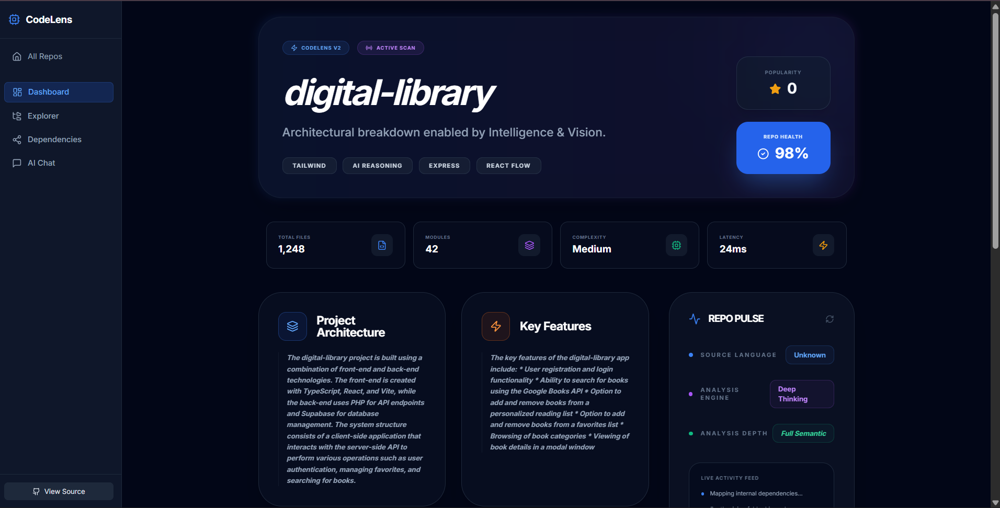
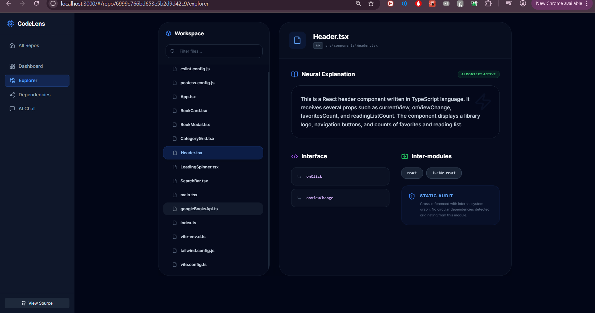
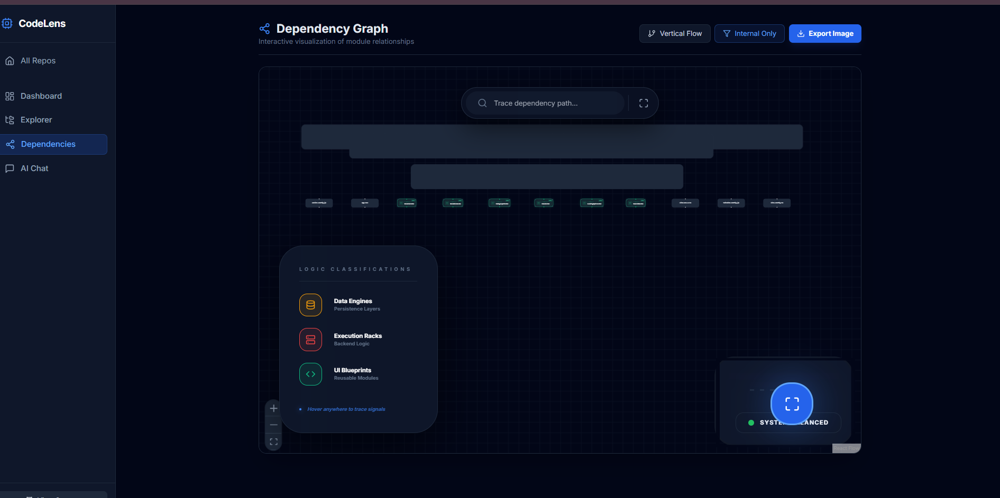
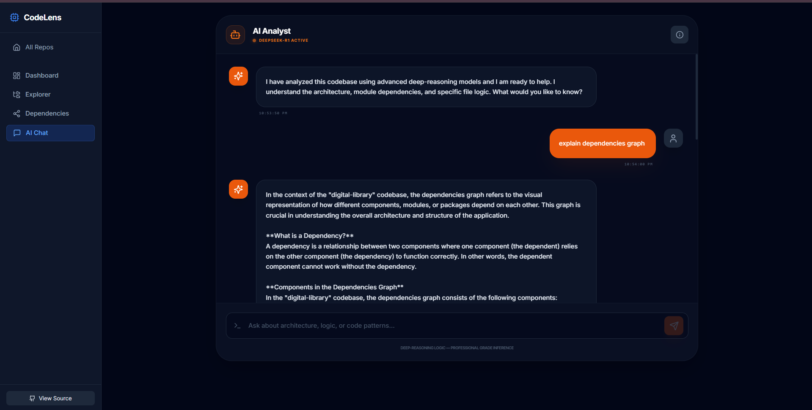

# CodePulse AI - Production-Ready Codebase Analyzer

CodeLens AI is an advanced repository understanding platform that combines static code analysis with state-of-the-art Large Language Models (LLM) to provide developers with instant, visual, and conceptual insights into any codebase.


## 📸 Screenshots

| Home | Dashboard |
|-----|-----------|
|  |  |

| Code Analysis | Dependency Graph |
|--------------|------------------|
|  |  |

| AI Explanation |
|----------------|
|  |

## 🚀 Features

- **Deep Repository Scanning**: Automatic cloning and recursive traversal of public GitHub repositories.
- **AI-Powered Explanations**: Every file is analyzed by a deep-reasoning intelligence engine to explain its purpose, key functions, and role in the system.
- **Architectural Mapping**: High-level summaries of project structure and design patterns.
- **Dependency Visualization**: Interactive graph showing how components and modules interact.
- **Developer Chat**: A contextual AI assistant trained on the specific repository's codebase.

## 🏗 Architecture

```text
[Frontend (React)] <---> [Backend API (Node/Express)] <---> [MongoDB Atlas]
                                |
                                v
                        [Analysis Worker] <---> [Intelligence Engine API]
                                |
                                v
                        [Github (Simple Git)]
```

## 🛠 Tech Stack

- **Frontend**: React 18, Tailwind CSS, Lucide React, React Flow, Axios.
- **Backend**: Node.js, Express, MongoDB (Mongoose), Simple Git.
- **AI**: High-performance Inference Cluster (deep-reasoning optimized).
- **Deployment**: Vercel (Frontend), Render (Backend), MongoDB Atlas (Database).

## ⚙️ Installation & Setup

### Prerequisites
- Node.js (v18+)
- MongoDB Atlas Account
- Intelligence Cluster API Key

### 1. Environment Configuration
Create a `.env` file in the `backend/` directory:
```env
PORT=5000
MONGODB_URI=mongodb+srv://...
AI_API_KEY=your_api_key_here
```

### 2. Run Locally
Execute these commands from the **root directory**:

```bash
# Install all dependencies
npm install

# Run Frontend and Backend concurrently
npm start
```
- **Frontend**: http://localhost:3000
- **Backend API**: http://localhost:5000

## 📂 Project Structure

- `/components`: Reusable UI components (FileTree, Layout, Cards).
- `/pages`: Main application views (Dashboard, Explorer, Chat).
- `/backend`: Node.js server, Mongoose models, and Background Worker.
- `/services`: API clients for Frontend-Backend communication.

## 📝 API Documentation

- `POST /api/repos/analyze`: Start analysis for a GitHub URL.
- `GET /api/repos/:id`: Fetch high-level repo metadata.
- `GET /api/repos/:id/files`: Get the full analyzed file tree.
- `GET /api/repos/:id/dependencies`: Get dependency graph data.

---
*Built with ❤️ for the Developer Community.*
